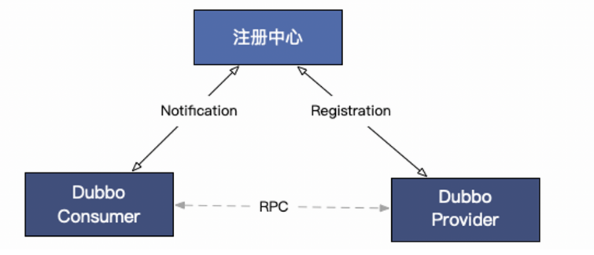

# 1.主要组件
  
## 1.1 consumer
服务消费者

1. 按需订阅服务提供者，无需订阅全部的服务
2. 除了与注册中心链接，还会与服务提供者建立元数据通路

## 1.2 provider
服务提供者，需要注册到注册中心，dubbo2是服务级别的注册，每个方法都会注册。dubbo3是应用级的注册。

## 1.3注册中心
支持多种注册中心，zk、nacos、consul

## 1.4元数据通路
dubbo2中注册中心包含了丰富的信息，比如超时时间、注册的方法、自定义参数等。

dubbo3改为应用级注册后，这些信息都不再传到注册中心。而是通过消费者与提供者直连来传递这些信息