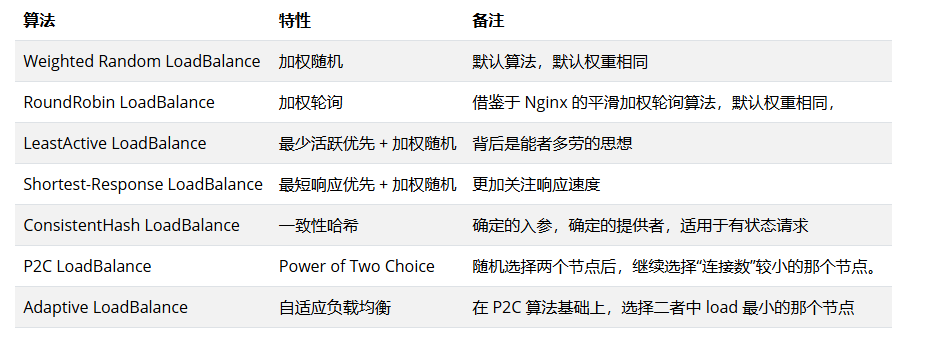
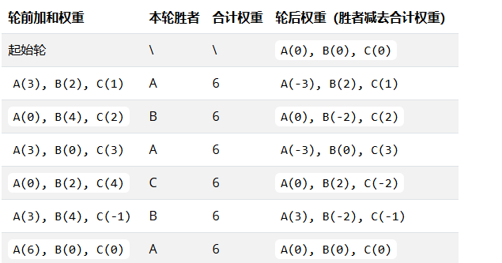

# 1.加权随机
默认算法，按照权重随机
  

# 2.加权轮询
按公约后的权重设置轮询比率，循环调用节点。
  

# 3.加权最少活跃调用优先
活跃数越低，越优先调用，相同活跃数的进行加权随机

# 4.加权最短响应优先
在最近一个滑动窗口中，响应时间越短，越优先调用。相同响应时间的进行加权随机。

# 5.一致性 Hash
相同参数的请求总是发到同一提供者

# 6.Power of Two Choice
对于每次调用，从可用的provider列表中做两次随机选择，选出两个节点providerA和providerB。

比较providerA和providerB两个节点，选择其“当前正在处理的连接数”较小的那个节点。

# 7.Adaptive Load Balance
Adaptive 即自适应负载均衡，是一种能根据后端实例负载自动调整流量分布的算法实现，它总是尝试将请求转发到负载最小的节点。

