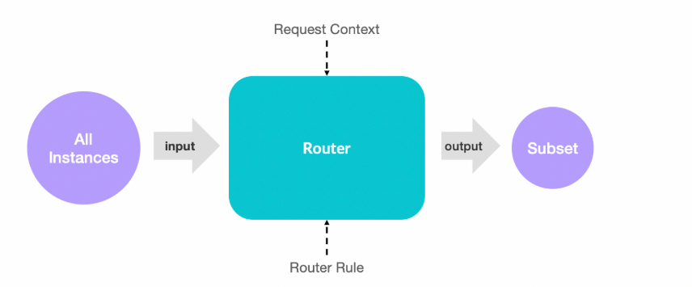
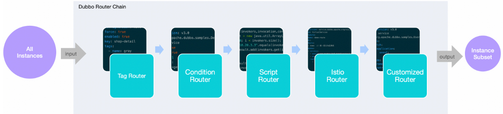

# 1.工作原理
## 基本流程
1. 路由器接收一个服务的实例地址集合作为输入，
2. 基于请求上下文 (Request Context) 和 (Router Rule) 实际的路由规则定义对输入地址进行匹配
3. 所有匹配成功的实例组成一个地址子集
4. 最终地址子集作为输出结果继续交给下一个路由器或者负载均衡组件处理。
  

## 多个路由
多个路由器组成一条路由链共同协作，前一个路由器的输出作为另一个路由器的输入，经过层层路由规则筛选后，最终生成有效的地址集合

每个服务都有一条完全独立的路由链，每个服务的路由链组成可能不同，处理的规则各异，各个服务间互不影响。
  

# 2.路由规则分类

## 2.1 标签路由
在consumer端请求时加上标签，那么请求只会发给相同标签的provider

标签路由不会自动传递,请求标签的作用域仅为一次点对点的 RPC 请求
>比如，在一个 A -> B -> C 调用链路上，如果 A -> B 调用通过 setAttachment 设置了 tag 参数，则该参数不会在 B -> C 的调用中生效，同样的，在完成了 A -> B -> C 的整个调用同时 A 收到调用结果后


### 静态标签
实例启动前给实例打标签，修改需要重启

### 动态标签
优先级比静态高，实例运行中给实例打标签.

以下规则对 shop-detail 应用进行了动态归组，匹配 env: gray 的实例被划分到 gray 分组，其余不匹配 env: gray 继续留在默认分组 (无 tag)。
env可以通过配置文件配置，或者通过环境变量，这种方式主要是为镜像打包考虑的，不用修改应用的配置文件，而是可以从外部读取配置。跟想象中的实时打不一样。

```yaml
configVersion: v3.0
force: true
enabled: true
key: shop-detail
tags:
  - name: gray
    match:
      - key: env
        value:
          exact: gray
```
### consumer使用
RpcContext.getContext().setAttachment(Constants.TAG_KEY, "gray");


## 2.条件路由
可以conditions条件来匹配路由规则，条件路由配置如下，conditions语法详见dubbo官方文档：
```yaml
configVersion: 3.0
scope: service   #有service和application两种，应用级别和服务级别
force: true #强制按条件走路由，如果匹配的结果为空则报错。false表示不强制，没有就随机选一个
runtime: true #是否为每个rpc调用运行路由规则或使用路由缓存‘
enabled: true #是否生效
key: com.test.MyService  #如果scope为service则填服务名，否则填应用名
conditions:
  - method=test => region=Beijing  #条件，调用test方法时，走region为Bejing的服务
```


## 3.脚本路由
只对消费这生效，只支持应用力度管理。key
```yaml
configVersion: v3.0
key: demo-provider
type: javascript
enabled: true
script: |
  (function route(invokers,invocation,context) {
      var result = new java.util.ArrayList(invokers.size());
      for (i = 0; i < invokers.size(); i ++) {
          if ("10.20.3.3".equals(invokers.get(i).getUrl().getHost())) {
              result.add(invokers.get(i));
          }
      }
      return result;
  } (invokers, invocation, context)); // 表示立即执行方法  
```


## 