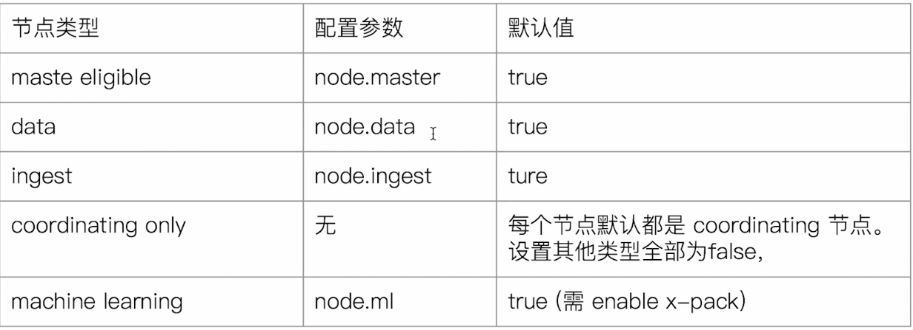

# 1.集群节点
## Master-eligible nodes
1. 启动后默认就是Master eligible
2. 可以参见选主，成为Master节点
3. 可以通过node.master:false来禁止

## Master node
1. 每个节点都保存了集群的状态，但只有master可以修改集群状态

## DataNode
1. 可以保存数据的节点，负责保存分片数据
   
## Coordinatiing Node
1. 负责接收Client的请i去，将请求分发到合适的节点，最终把结果汇集到一起
2. 每个节点默认都起到了Coordinating Node的职责

  


# 2.集群状态
```sh
GET _cluster/health
###结果如下
{
  "cluster_name" : "my-es-cluster",
  "status" : "green",
  "timed_out" : false,
  "number_of_nodes" : 3,
  "number_of_data_nodes" : 3,
  "active_primary_shards" : 13,
  "active_shards" : 26,
  "relocating_shards" : 0,
  "initializing_shards" : 0,
  "unassigned_shards" : 0,
  "delayed_unassigned_shards" : 0,
  "number_of_pending_tasks" : 0,
  "number_of_in_flight_fetch" : 0,
  "task_max_waiting_in_queue_millis" : 0,
  "active_shards_percent_as_number" : 100.0
}
```
1. green：主分片与副分片都正常分配
2. yellow：主分片全部正常，副分片部分未正常分配
3. red：有主分片未分配

