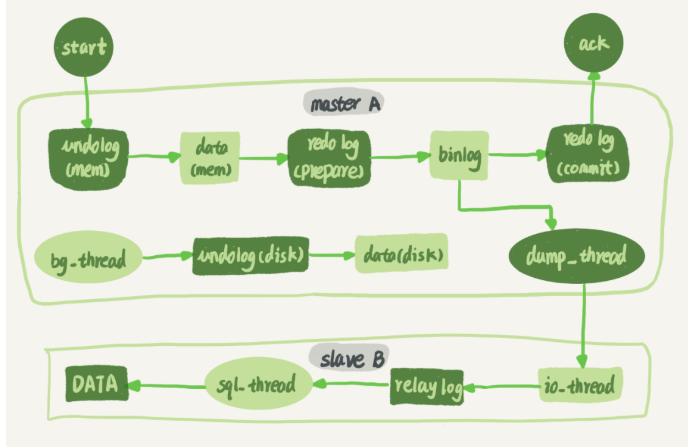
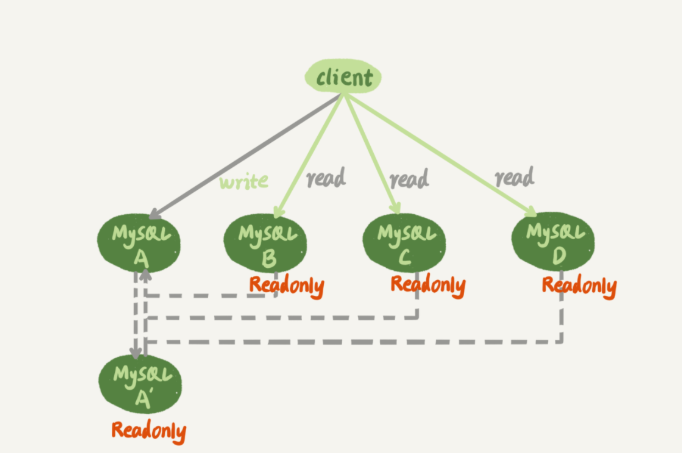

# 1.主从复制
## 1.1 基本原理
1、从库启动io线程与主库建立长连接 
2、主库启动dump线程，通过长连接将binlog发送到从库 
3、从库io线程将数据写入relaylog， 
4、从库sql线程重放relaylog。 
  

## 1.2 主备延迟
造成原因： 
1、备库机器配置差，写入速度本身就慢 
2、备库除了写，可能还承担了一些执行时间很长的读，备库压力大 
3、大事务影响。 
4、备库的并行复制能力影响。

# 2.主备切换
基本流程为验证主备的延迟，如果延迟为0了，就将主库设置为仅可读，然后将业务请求切换到备库。有两种方案，可靠性优先和可用性优先方案。
## 2.1可靠性优先
可靠性方案会有一段时间不能写入数据，即2~5步骤会不可用，流程如下： 

1、判断备库的seconds_behind_master（延时时间），如果小于某个值则继续下一步，已减少不可用时间。 
2、将主库切换成只读，即readonly为true 
3、判断备库的seconds_behind_master的值，直到这个值变成0 
4、将备库改为可读写，即readonly设置成false 
5、将业务切换到备库 

## 2.2可用性优先
可用性优先可能导致数据不一致，因为会有主备同时写入的情况。如果有自增的id，那么可能就有相同的自增id。导致同步暂停。

# 3.一主多从
一主多从架构通常如图所示，A和A'互为主备。 B、C、D均为从库
  

# 4.读写分离
主从查询数据不一致如何解决：
1、强制走主库 
2、Sleep方案：可以利用业务上的操作延迟，比如添加或者修改数据后前端直接展示修改后的数据。而不是立即从数据库查询。等用户实际去查的时候可能已经过了一段时间了
3、判断主备无延迟方案：
show slave status的输出来判断主备延迟
>通过seconds_behind_master判断主备延迟时间是不是为0，不为0才查询。 
>对比位点判断：Master_Log_File和Read_Master_Log_Pos，表示的是读到的主库的最新位点；Relay_Master_Log_File和Exec_Master_Log_Pos，表示的是备库执行的最新位点。如果Master_Log_File和Relay_Master_Log_File、Read_Master_Log_Pos和Exec_Master_Log_Pos这两组值完全相同，就表示接收到的日志已经同步完成。 
>通过GTID判断：Retrieved_Gtid_Set，是备库收到的所有日志的GTID集合；Executed_Gtid_Set，是备库所有已经执行完成的GTID集合。如果这两个集合相同，也表示备库接收到的日志都已经同步完成。 

4、配合（semi-sync）半同步复制：
主备无延迟只能说是已经接收到的日志没有延迟，还有可能日志根本还没从主库传到从库。这时候可以半同步复制来
配合判断。 
半同步日志是事务提交时，binlog从主库发送到了从库，并且从库ack后才给客户端返回事务完成。

5、等主库位点方案
