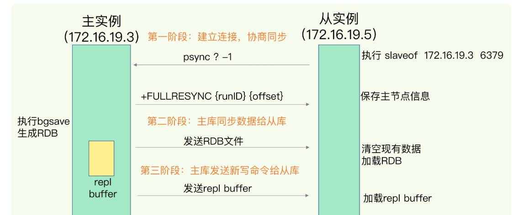

# 1.主从
主从的命令
```sh
replicaof ip port
```
## 1.2同步流程
1、建立连接<br>
2、主库生成全量的RDB文件发送给从库，并且会记录增量写操作保存到replicatioin buffer，同时写到repl_backlog_buffer<br>
3、将replication buffer的写操作传给从库<br>
  

**replication buffer**:主库给每个从库一个replication buffer，命令被从库接受后，占用的内存就可以释放，用来写新的命令了。<br>
**repl backlog buffer**：环状缓存，有master_repl_offset来记录写入点(他是递增的，实际是用repl_backlog_idx来记录写入点)，slave_repl_offset记录从库的读取点。当从库断线重连后就会用这个buffer里面记录的命令来接着恢复。如果环状缓存被覆写了，那就要用rdb全量重建了。<br>
**为什么要用两个缓存？**<br>
正常增量用replcation buffer可以及时清理已经同步过的命令，使得内存占用少。<br>
slave backlog buffer是要承担断连恢复的功能，保存的命令越多，能支持更久的断链时间就越久，所以通常要设置得大一点，单独用这个缓存作为所有从库的一个共享缓存就可以减少内存的使用。<br>


# 2. 哨兵
redis可以通过哨兵机制来保证高可用，用专门的哨兵节点来监控主库，发送故障时选择一个从库切换成主库。并让其他的从库和客户端连接到新的主库
## 2.1哨兵的基本流程
### 2.1.1 监控
监控，即监控主从库有没有挂掉。哨兵通过主观下线和客观下线机制来确认主库是否下线
#### 主观下线
哨兵定时发送PING给监控的服务，如果响应超时就可以将它标记成”主观下线“。
#### 客观下线
哨兵有多个，对于主库，只有超过一半的哨兵将主库标记成主观下线，主库才会变成客观下线，就会开始重新选主的流程。
### 2.1.2 选新主
选定一个从库为新的主库，通过如下条件来筛选：
#### 过滤不符合条件从库
1、过滤掉已经下线的从库。<br>
2、过滤掉经常跟主库断连的从库。可以配置断连多少次就会被过滤掉<br>
#### 从库选择
逐次判断下面三个条件选择出新的主库：<br>
1、优先级最高的被选为新的主库，这个优先级是可以配置的
2、和主库同步程度最高的选择为新的主库，具体来说就是判断从库的同步位点slave_repl_offset，最大的<br>
3、默认ID号最小的选为新的主库<br>

### 2.1.4 哨兵选举
#### 哨兵的通信
哨兵利用redis发布订阅功能来获取信息，并建立集群<br>
1、哨兵与主库建立连接<br>
2、哨兵将自己的ip和端口发布到**__sentinel__:hello**<br>
3、其他哨兵通过频道获取对方的信息，并建立连接<br>
4、哨兵通过给主库发送INFO命令，获取从库的信息<br>
#### 选举
1、一个哨兵发现主库下线，就将主库标记为主观下线。并给其他哨兵发命令，查询是否也被其他哨兵标记成主观下线<br>
2、一但这个哨兵获得指定数量（通过quorum配置项配置）的赞成票，就将主库标记成客观下线<br>
3、这个哨兵将主库标记成客观下线后，就直接开始竞选leader，具体为先给自己投一票。再向其他哨兵发送命令，让其他哨兵投票<br>
4、其他哨兵接收到命令，如果自己还没投过票，就投一票。如果已经投过了就不投<br>
5、当某个哨兵的获票数超过半数，并大于等于quorum数，则这个哨兵成为leader<br>
6、如果恰好没有选出leader，则间隔一段时间后重新选举
### 2.1.3 切换主库
由选举出来的哨兵，进行实际的切换主库流程。比如：
1、将选中的从节点提升为主节点<br>
2、修改其他从节点的复制目标<br>
3、更新主节点的配置（如果恢复）<br>
4、通知客户端：哨兵通过特定的频道广播新的主节点地址；客户端通过订阅哨兵的频道，或者查询哨兵api获取新的主节点，并重连。<br>

# 3. 集群
redis将一个集群分为16384个哈希槽（2的14次方），默认情况下将这些哈希槽均匀分布到各个实例上。每个键值对根据key的crc16计算结果对16384去摸后得到槽编号。<br>
## 3.1 客户端获取槽分布
redis实例间是互相通信的，可以拿到所有槽的分布。客户端就可以通过某个实例获取所有的槽分布信息了。客户端会缓存这个信息
## 3.2 重定向
redis的槽重新分配后，客户端可能不能及时知道，如果redis接收到的命令发现这个键没在当前实例上，那么就会将命令重定向到键所在的实例，并返回槽的实例信息给客户端。

## 3.3 槽迁移
扩容或者手动迁移槽到其他的实例的过程中，如果收到了命令，并且这个键没在当前实例了，那么就会返回新的实例给客户端，客户端需要重新请求新的实例，迁移中的槽不会刷新客户端的槽信息，

## 3.4 扩容
集群扩容后，会从其他的实例转移一些槽位到新的实例中。<br>
提前将集群分配为固定的槽数，可以减少迁移的数据量（相比较直接对实例数取模）<br>

## 3.5 lua脚本跨槽
集群不允许lua脚本的key跨槽。可以通过使用哈希标签来将键分布到同一个槽。
```lua
#将哈希标签用大括号包起来，这样计算哈希值时就用标签内容计算，只有第一个大括号的才会计算
{标签内容}其他部分
```
