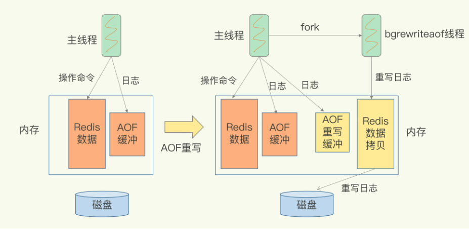

# 1. AOF日志
命令执行后写日志，将执行的命令写入到文件中。是一种写后日志。
## 1.1 刷盘策略
1、Always：同步写回，每个写命令执行完，立马同步地将日志写回磁盘
2、Everysec：每秒写回，每个写命令执行完，只是把日志写AOF文件的内存缓冲区，每隔一秒把缓冲区中的内存写入磁盘
3、NO：把AOF写到内存缓冲区等操作系统内容写回磁盘

## 1.2 AOF重写
对同一条数据进行了多次修改，会有多条日志在AOF文件中，但实际只需要记录数据最后的版本就行。AOF重写就是直接根据内存的数据将日志重写成一条日志

### 1.2.3 重写的原理
1、由后台线程来完成重写 
2、主线程直接fork一个子进程出来 
3、子进程根据内存重写一个AOF文件 
4、重写过程中的日志会写到原来的AOF文件 
5、重写过程中的日志还会写到新的的AOF文件缓冲区，等重写日志结束后再把日志应用到新的AOF文件上 
  

## 1.3 AOF的优缺点
**优点：**
1、通过写回策略可以减少数据的丢失 
**缺点：**
1、数据多时文件大 
2、恢复速度慢 

# 2.RDB内存快照
RDB是将当前数据快照保存到文件中
## 2.1 生成快照的两种方式
**save：**主线程来生成快照，阻塞其他命令。 
**bgsave：**fork一个子进程，专门用来写入RDB文件。 
## 2.2 写时复制
fork出来的子进程跟主进程实际是共享一份内存数据，如果只有读那么两边互不影响。但是主进程一但要修改数据，就会利用操作系统的写时复制技术（copy-on-write）将内存拷贝一份，子进程继续读拷贝出来的数据，保证数据不变。

## 2.3优缺点
**优点：**
恢复数据快，文件小
**缺点：**
不能频繁做快照，给系统带来压力

# 3.混合模式
一定频率执行RDB备份，两次备份见用AOF日志记录操作。

