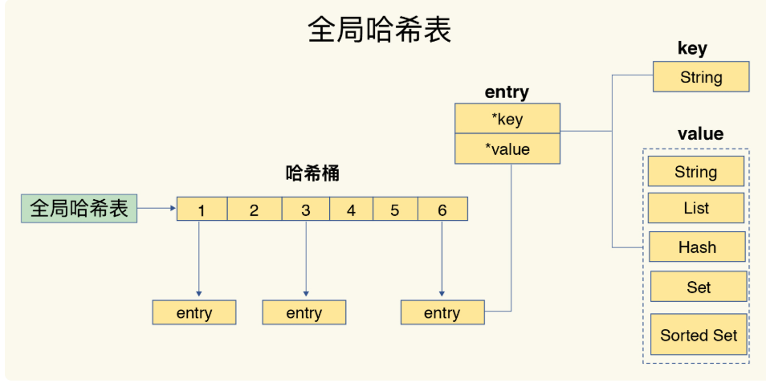
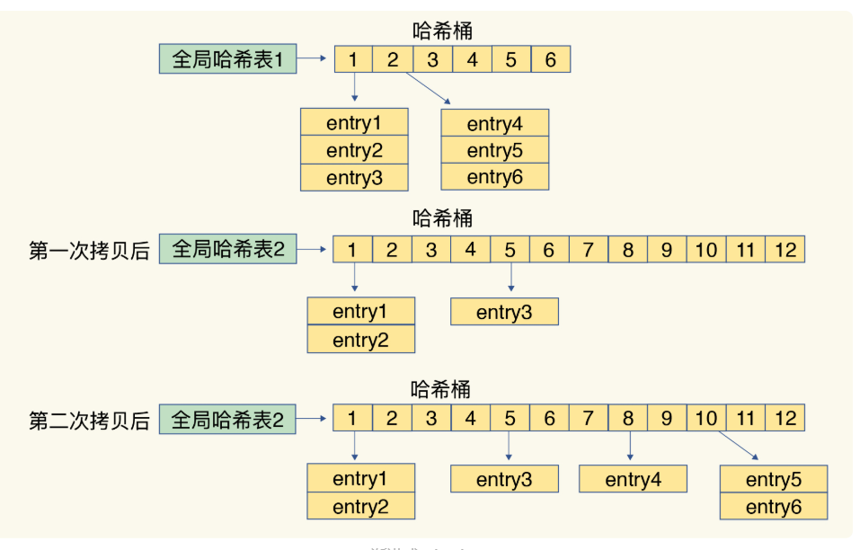
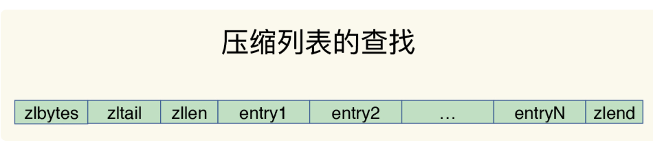
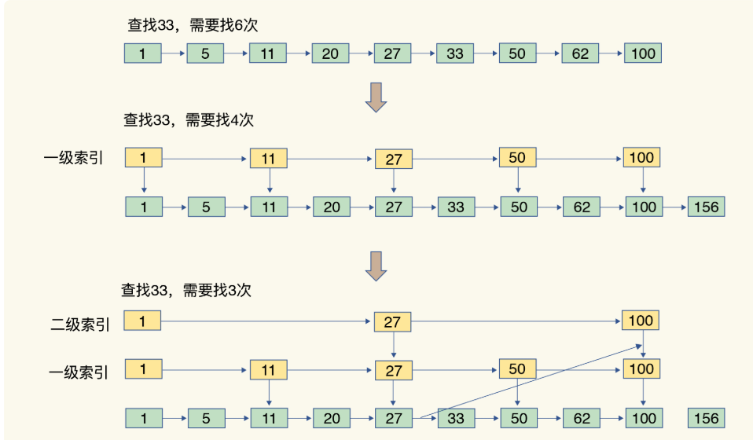

# 1.基本数据类型
String：简单动态字符串 
List：双向链表、压缩列表 
Hash：哈希表和压缩列表 
Set：哈希表和整数数组 
Sorted Set：压缩列表和跳表 
## 1.2键值对的结构
redis使用哈希表来存键值对，默认有两个全局哈希表。用来进行rehash
  
## 1.3渐进式rehash
当全局好哈希表的容量不够时，就需要将数据复制到另一个更大的哈希表中。一次性复制过去耗时可能过长，所以用渐进式的方式： 
每次请求过来将哈比表的一个索引位置的数据拷贝过去，下次请求再拷贝下一个索引位置。
  

# 2.数据结构
## 2.1 简单动态字符串
## 2.2 双向链表
前后指针，增删快，占内存大
## 2.3 压缩列表
查找表头表尾的时间复杂度为O(1)，结构如图所示：
>zlbytes：列表的长度 
>zltail：列表尾的偏移 
>zllen：列表的元素个数 
>zlend：列表尾部 
  

## 2.4 哈希表
## 2.5 跳表
跳表是将有序链表的某些数据提取出来放到上层，作为数据的索引，结构如图所示：
  

## 2.6 整数数组