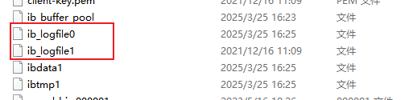
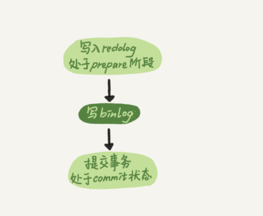
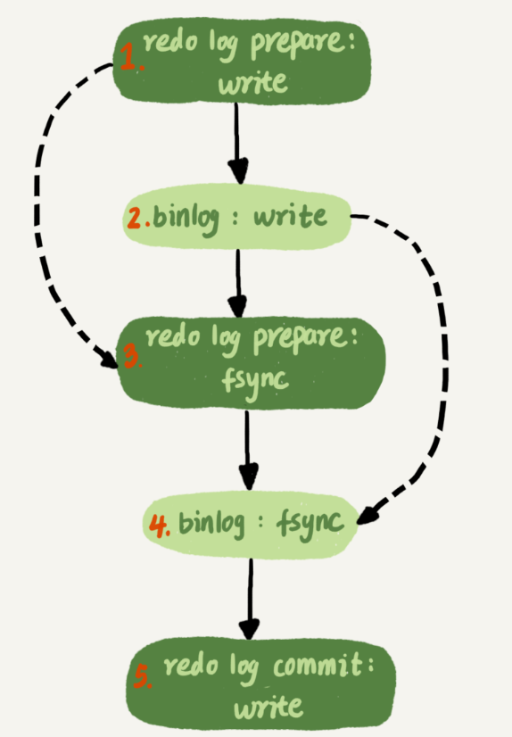
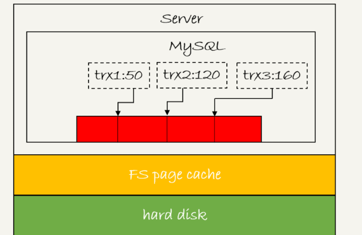
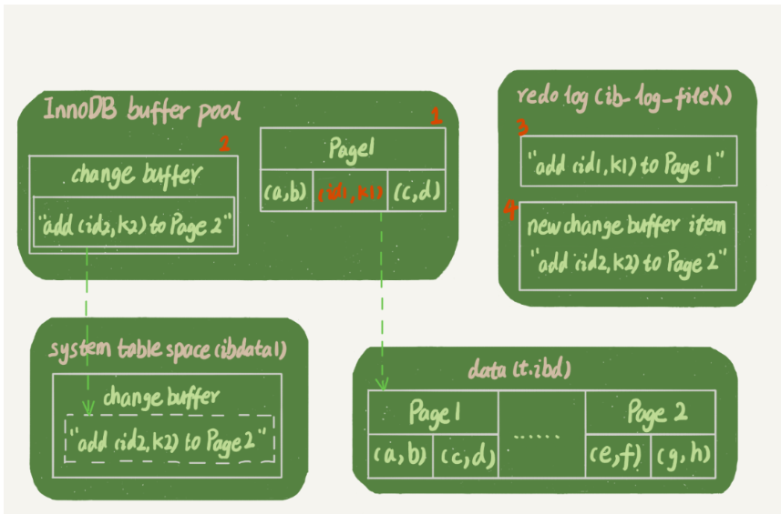

## 1.redo log 概述

redo log 是 innodb 的持久化日志，使用的是 WAL（write-Ahead Logging）的机制，即将数据写入磁盘前先记录修改操作日志，redo log 记录的是数据页的修改。用于崩溃恢复，并通过顺序写和组提交来提高写入性能。

## 2.日志文件形式

redolog 是循环写的日志，多个日志文件可以看做头尾相连的一个整体，mysql 用 checkpoint 和 write pos 来记录当前写入的位置和已经将数据刷盘的位置，ib_logfile 就是 redolog 日志文件

## 3.写入流程

### 3.1总体写入流程

由于 mysql 同时还拥有 binlog 日志，所以 redo log 日志跟 binlog 日志还需要保持一致，mysql 使用两阶段提交来保证一致性。具体如下：

如果在写入 binlog 前崩溃，事务视为位提交，redo log 丢弃 prepare 的数据，如果在 binlog 写入后提交，mysql 会恢复时会将 prepare 的日志修改为 commit，以保证一致性。

> **XID**：从崩溃恢复流程来看，redo log 和 bin log 需要建立某种关联。 不然无法找到同一个事务对应的日志。这关联就是 XID。 
> mysql 在内存中维护变量 global_query_id，每次执行语句将这个赋值给 Query_id，如果这个语句是事务的第一条语句，那么同时会把 Query_id 赋值给 Xid。

### 3.2详细写入流程

#### 3.2.1 基础概念

**redo log buffer**：用来缓存redo log日志，一个事物可能有多次数据修改，每次修改都要生成日志，这时日志不会直接写盘，而是保存在缓存中。等待提交或者其他时机刷到磁盘

**write**：将数据写入到操作系统的page cache中

**fsync**：从page cache写入到磁盘的操作

**innodb_flush_log_at_trx_commit**：
>0表示事物提交时只把redo log留在redo log buffer中 
>1表示刷到磁盘中 
>2表示刷到page cache 

**刷盘时机**：
>1、后台线程每秒一次将redo log buffer刷到磁盘，没提交的也刷 
>2、redo log buffer占用空间到达innodb_log_buffer_size一半时（write操作） 
>3、其他事务提交的时候顺带将这个事物的redo log buffer持久化到磁盘 

#### 3.2.2 实际写入流程

由于write和fsync，实际刷盘可以分成4步，redo log和binlog先write再fsync 
  
**LSN**：log sequence number 日志逻辑序列，单调递增的，用来对应redo log的一个个写入点。每次写入长度为length的redolog，LSN的值就加length。LSN会被写入到数据页中，确保redolog不会重复应用。

**组提交**：
当持久化redolog时，如果有多个事务的redolog在buffer里面了，提交时会将第一个事务选为组内leader，并在刷盘时将组内最大的LSN携带过去，将3个事务的redolog一起刷盘。将刷盘分为四步，可以在sync redolog时一次刷更多的数据
  

## chagne buffer
change buffer是用来缓存更新操作记录的，他用于非唯一的二级索引。当数据需要更新时，正常流程需要将数据加载到内存中，然后更新数据。但是有了change buffer，可以不将数据加载到缓存，而是将修改记录到缓存中。当下次查询数据将数据加载到缓存时再应用change buffer。 这样可以减少磁盘的读。
  

**为什么只用于非唯一二级索引？**
因为对于唯一索引，修改时需要检查唯一性，就需要把数据加载到内存中，没必要用change buffer了。

### 插入数据
对于插入数据，直接将要插入的数据记录到change buffer即可

### 更新数据
更新数据某些情况下可以用到change buffer，比如udpate t1 set a = 1 where id =0; 如果a上有索引，那么聚簇索引和a索引上的数据都要更新，聚簇索引更新要加载到内存中。而对二级索引的更新就可以先用change buffer缓存。