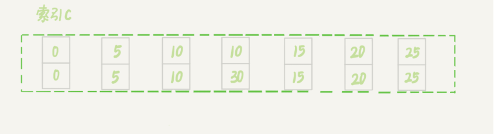

# 1.全局锁
使用如下命令可以加全局锁，Flush tables with read lock (FTWRL)，让整个库处于只读状态，其他线程的更新语句都会被阻塞，一般用于不支持事务的引擎的备份。
# 2.表级锁
## 2.2表锁
**语法**：
> 加锁：lock tables... read/write <br>
> 释放： unlock tables

## 2.3元数据锁（MDL）
元数据锁不需要显示使用，访问一个表时会被自动加上。对一个表做增删改自动加MDL读锁。对表进行变更时加MDL写锁。
## 2.4意向锁
相当于一个标记，表示这个表有事务在加读锁或者写锁，用于快速判断。比如表已经有行锁了，此时加表写锁就要先一行行判断是否有锁，但意向锁就可以快速判断出来这个表已经加了锁了。

**IS意向共享锁**：当事务想要对表中的某一行添加共享锁时，会先在表级别添加意向共享锁。这表明事务打算在表中的某些行上获取共享锁。

**IX意向排他锁**：当事务想要对表中的某一行添加排他锁时，会先在表级别添加意向排他锁。这表明事务打算在表中的某些行上获取排他锁。

# 3.行锁
## 3.1两阶段提交
定义：需要锁时申请锁，但是在事务提交时才统一释放锁。分为申请和提交两个阶段。因此将对并发影响少的更新放到事务的最后有助于减少锁持有的时间，提高并发度。
## 3.2定义
行锁就是对数据的某行加锁，可以加读锁也可以加写锁。

## 3.3加锁方式
### 写数据
udpate 会自动加上写锁
### 读数据
> 加读锁：select *from t where xxx lock in share mode <br>
> 加写锁：select *from t where xx for update <br>

# 4.间隙锁和next lock
## 4.1间隙锁
**定义**：间隙锁指的是给行与行直接的间隙加锁，并且这个锁是动态的，边界的数据删除可能会导致锁的扩张（间隙变大了）。间隙锁在可重复读下才有（解决幻读的问题）

**锁冲突**：间隙锁跟间隙锁之间不会冲突，也就没有读写之分。跟间隙锁冲突的是“往间隙插入数据”这个操作。

## 4.2next lock
将间隙锁和行锁加起来就是next lock。是一个前开后闭的区间，例如：(5.10]。


# 5.加锁分析
innodb的锁是跟执行计划相关的，同一条语句如果执行计划不一样，那么加的锁也可能不一样。总体原则如下：
>1、加锁的基本单位是next lock，一个前开后闭的区间。但是加锁的步骤实际是两步，即加间隙锁和行锁<br>
>2、查找过程中要访问的对象才会加锁。所以加的锁跟实际执行过程有关。<br>
>3、优化1：索引上的等值查询，给唯一索引加锁时会，next-lock退化为行锁<br>
>4、优化2：索引上的等值查询，**向右**遍历时，且最后一个值不满足等值条件的时候，next-lock退化成间隙锁<br>
>5、一个bug：唯一索引上的范围查询会访问到不满足条件的第一个值为止。

以表t为例分析加锁：
```sql
CREATE TABLE `t` (
  `id` int(11) NOT NULL,
  `c` int(11) DEFAULT NULL,
  `d` int(11) DEFAULT NULL,
  PRIMARY KEY (`id`),
  KEY `c` (`c`)
) ENGINE=InnoDB;

insert into t values(0,0,0),(5,5,5),
(10,10,10),(15,15,15),(20,20,20),(25,25,25);
```
  

## 5.1等值查询间隙锁
```SQL
udpate t set d=d+1 where id=7;
```
该语句更新的数据实际没有存在，查询时走的主键索引。那么会加哪些锁呢？

>1、查询走主键索引，并且7这个条数据不存在，那么查询时实际查到的是区间(5,10)，所以加锁加的是(5,10]这个next-lock<br>
>2、由于等值查询，并且10实际不满足条件，所以next-lock退化成间隙锁(5,10)<br>

## 5.2非唯一索引等值锁
```sql
select id from t where c=5 lock in share mode;
```
1、这是一个覆盖索引查询，并且加的是读锁，查询走索引c。<br>
2、查到了c=5这条数据，所以加上了next-lock(0,5]<br>
3、接着会扫描到10这条数据才会确定c=5的数据不存在，所以c=10也被扫描到了，会加next-lock(5,10]<br>
4、等值查询，所以(5,10]next-lock退化成间隙锁(5,10)<br>
5、lock in share mode走覆盖索引时，不会给主键索引对应行的数据加锁，但是for update会。<br>

## 5.3主键索引范围锁
```sql
1、select * from t where id=10 for update;
2、select * from t where id>=10 and id<11 for update;
```
第一条
>1、查询直接走的主键索引，定位到id=10这条数据，加next-lock锁(5,10]<br>
>2、唯一索引退化成行锁，所以最终加行锁10<br>

第二条
>1、查询先找到10，加next-lock锁(5,10]，但是由于是等值查询，会退化成行锁10<br>
>2、接着向右扫描到数据15，加next-lock(10,15]。id<11走的是范围查询，不会优化掉15的行锁。（可能后续版本会吧）<br>

## 5.4非唯一索引范围锁
```sql
select *from t where c>=10 and c<11 for update;
```
>1、走c索引，找到10数据，加next-lock (5,10]
>2、继续往下查找到15，加next-lock (10,15]
>3、10这一行和15这一行还会在主键索引上加行锁。
